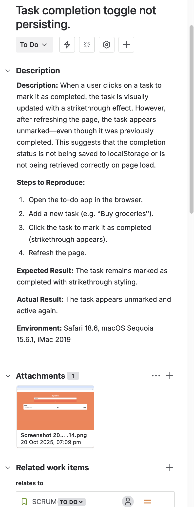

# JIRA Demo Project: Agile Workflow & Test Case Management

This repository showcases a demo JIRA project designed to reflect real-world Agile practices, including user story creation, task breakdown, and test case traceability. It’s part of my journey transitioning from music education and therapy into software testing and development.

---

## Project Overview

This demo simulates a lightweight Agile project using JIRA, with the following goals:

- Demonstrate understanding of **user stories**, **tasks**, and **test case design**
- Showcase **traceability** between stories and test cases
- Illustrate a basic **workflow** from backlog to done
- Reflect **ISTQB-aligned thinking** in test planning

---

## Structure

The JIRA board includes:

- **User Stories**: Written from the end-user’s perspective, focusing on value delivery
- **Tasks**: Technical or testing tasks linked to stories
- **Test Case Task**: A standalone task representing a manual test case, linked to a relevant story
- **Statuses**: Items move through “To Do” → “In Progress” → “Done”

---

## Screenshots

| View | Description |
|------|-------------|
|  | Scrum board showing workflow |
|  | Example of a well-structured user story |
|  | Task representing a test case linked to a story |
|  | Status transitions for tasks and stories |
|  | Status transitions for tasks and stories |

---

## 🧠 Why This Matters

As a music educator and therapist, I’ve always valued **structure**, **empathy**, and **adaptive learning**. These values now shape my approach to software testing and Agile collaboration. This project reflects:

- My **ISTQB Foundation** exam preparation
- A growing understanding of **Agile principles**
- My ability to **translate user needs into testable requirements**
- A commitment to **clear documentation and traceability**

---

## 🛤️ Next Steps

- Expand the board with more complex workflows (e.g. bug triage, sprint planning)
- Integrate with GitHub for issue tracking
- Add a mock **test plan** and **traceability matrix** in `/docs`

---

## 📬 Let’s Connect

If you're a hiring manager, mentor, or fellow learner, I’d love to hear your thoughts. Feel free to explore my [other projects](https://github.com/Tmoorin7) or reach out.
